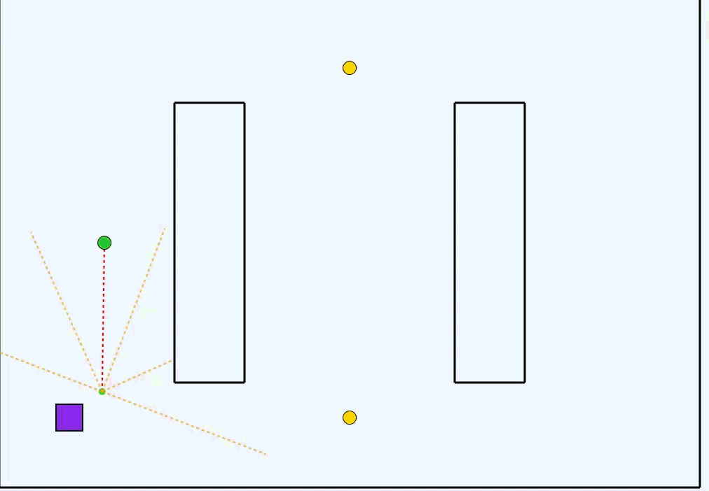
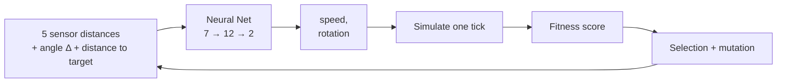

# 🤖 Warehouse-Robot Trainer

**Evolving neural networks that learn to run a warehouse — from scratch, no ML library, no labels.**

 

---

## Overview

**Warehouse-Robot Trainer** is a desktop sandbox where a population of 500 virtual robots evolves a neural network until it can pick up packages, avoid walls and return to a drop-off zone — without ever being told *how*.

Everything runs in real time on a WPF canvas: each robot perceives the world through five raycast sensors, the fittest survive every generation, mutated copies fill the rest, and after enough rounds the colony has effectively *learned to drive*. A trained brain can then be **fine-tuned on a specific warehouse layout** and replayed in a single-robot live demo.

## ✨ Highlights

- 🧠 **From-scratch neural network** — hand-rolled feed-forward net with tanh activations. No TensorFlow, no PyTorch.
- 🧬 **Genetic algorithm** — elite carry-over + per-weight mutation, fully parameterised.
- 👀 **5 raycast sensors** — short-range perception of walls, fed straight into the network.
- 🗺️ **Custom warehouse maps** — load any layout from a CSV of wall segments.
- 📦 **Custom package routes** — define a pickup sequence; the robot alternates package → drop-off automatically.
- 🎯 **Three modes** — generic *Basic Training*, low-mutation *Specialization* on a real map, single-robot *Live Demo*.
- ⏩ **Fast Forward** — burn through 100 generations off-screen for rapid iteration.
- 💾 **Portable brains** — save and reload trained networks as plain JSON.

## 🛠 How it works

Every robot reads **7 inputs** (five normalised sensor distances, the angle delta to its current target, and the distance to it) and outputs an acceleration and a turning command. Fitness rewards reaching packages and staying close to the next one; finishing the full route grants a large bonus. After each generation the top 10 % survive as elites; the rest of the next population are mutated copies of those elites.

## 🧰 Tech stack

- **Language** — C#
- **Runtime** — .NET 8 (Windows)
- **UI** — WPF / XAML, custom `Canvas` rendering
- **Persistence** — `System.Text.Json`
- **External ML libraries** — none
